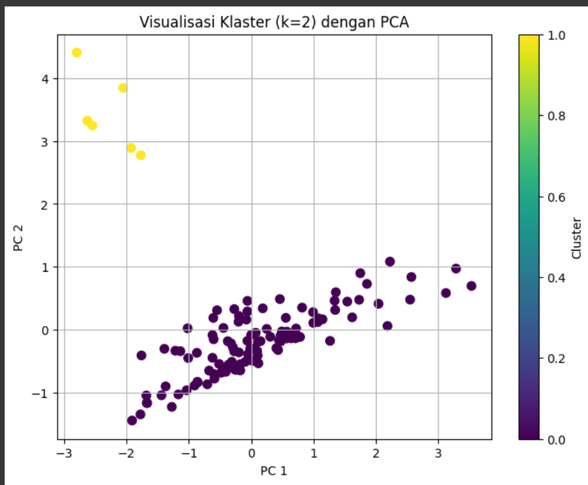
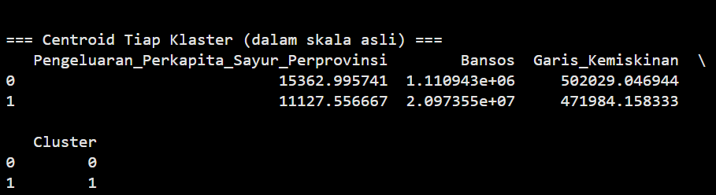

# Analisis Data Konsumsi Sayur dan Pengeluaran Perkapita Menggunakan Clustering

Proyek ini dilakukan untuk untuk mengidentifikasi klaster tiap provinsi berdasarkan faktor-faktor yang memepengaruhi pengeluaran konsumsi sayuran di Indonesia agar dapat memberikan rekomendasi strategi ketahanan pangan yang berguna bagi pihak terkait dalam merencanakan kebijakan distribusi dan pengembangan sistem budidaya sayuran yang lebih efisien dan berkelanjutan. Analisis dilakukan dengan pendekatan unsupervised learning menggunakan algoritma **K-Means Clustering**.

## Tools & Teknologi
- Python (Google Colab)
- Pandas, NumPy
- Scikit-learn
- Matplotlib, Seaborn

## Langkah Proyek
1. **Pemuatan Data**: Dataset diambil dari BPS
2. **Eksplorasi Data**: Pemeriksaan struktur data, ringkasan statistik, dan nilai kosong
3. **Pembersihan & Standardisasi**: Menghilangkan noise dan menyiapkan data untuk clustering
4. **Clustering**: Implementasi K-Means dan visualisasi hasil klasterisasi
5. **Evaluasi**: Penggunaan Sillhouette Score untuk menentukan jumlah cluster optimal

## Visualisasi

Keterangan:
- Ungu = kluster 0
- Kuning = kluster 1

## Hasil

Berdasarkan hasil proses klastering menggunakan metode K-Means dengan jumlah klaster k = 2, diperoleh dua kelompok utama provinsi yang memiliki karakteristik berbeda berdasarkan variabel: Pengeluaran Per Kapita Sayur per Provinsi, Jumlah Bantuan Sosial (Bansos), dan Garis Kemiskinan. Nilai centroid masing-masing klaster menunjukkan profil khas yang dapat dijadikan dasar interpretasi sebagai berikut:

**Klaster 0 : Wilayah berkembang dan daya beli tinggi**
- Pengeluaran Sayur per Kapita: 15.362,99 (tertinggi)
- Bantuan Sosial (Bansos): 1.110.943 (terendah)
- Garis Kemiskinan: 502.029 (tinggi)

Klaster ini mencerminkan provinsi-provinsi yang memiliki tingkat konsumsi sayur per kapita yang relatif tinggi, serta ketergantungan yang rendah terhadap bantuan sosial. Namun, garis kemiskinan yang lebih tinggi mengindikasikan bahwa biaya hidup di daerah-daerah ini juga cenderung tinggi. Provinsi dalam klaster ini kemungkinan merupakan wilayah perkotaan atau daerah dengan pertumbuhan ekonomi yang baik dan daya beli masyarakat yang cukup kuat. Rendahnya nilai bantuan sosial menunjukkan bahwa masyarakat di klaster ini tidak terlalu bergantung pada program perlindungan sosial pemerintah.

**Klaster 1: Wilayah Rentan dengan Ketergantungan Tinggi terhadap Bansos**
- Pengeluaran Sayur per Kapita: 11.127,56 (lebih rendah)
- Bantuan Sosial (Bansos): 20.973.550 (tertinggi)
- Garis Kemiskinan: 471.984 (lebih rendah)

Provinsi-provinsi dalam klaster ini menunjukkan tingkat konsumsi sayur yang lebih rendah, namun menerima bantuan sosial dalam jumlah yang sangat besar. Meskipun garis kemiskinan lebih rendah dibanding klaster 0, hal ini bisa jadi disebabkan oleh biaya hidup yang lebih rendah di wilayah tersebut. Klaster ini kemungkinan besar mencerminkan daerah-daerah yang masih tergolong tertinggal atau rentan, dengan ketergantungan tinggi terhadap intervensi pemerintah melalui program bansos.
